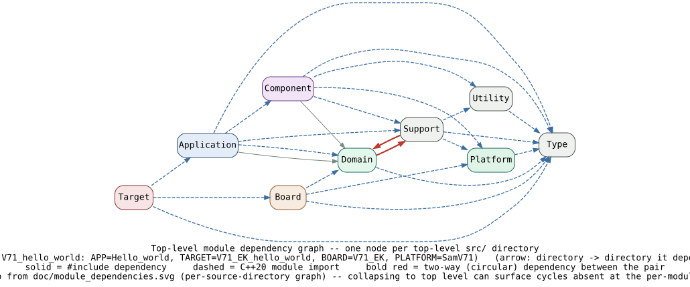
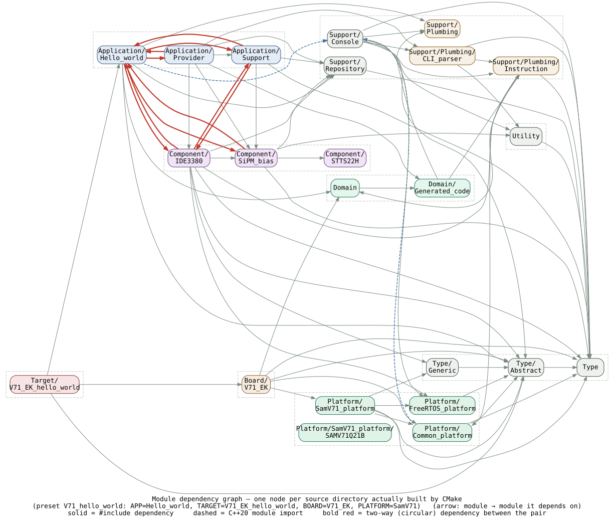
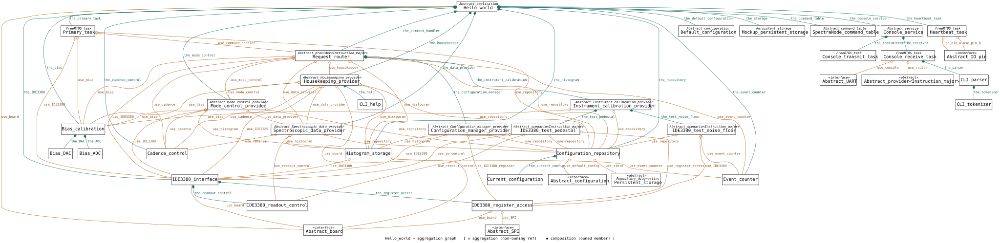
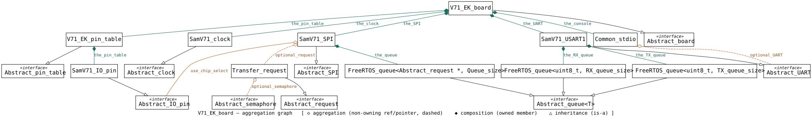

# AstraLEO Explore SAMV71 Peripherals, etc.

Build using GCC and C++20.
Using FreeRTOS (FreeRTOSv202604.01-LTS).

## Top-level modules

- **`Application/`** — the app itself: `Hello_world` (composition root, wired up in
  `main()`), `Provider` (the data providers it routes requests to) and `Support` (C helper
  code, e.g. the gamma peak detector and isotope table).
- **`Board/`** — board support packages, one per physical board (currently `V71_EK`),
  wiring together the platform, components and pin table for that board.
- **`Component/`** — drivers for discrete hardware parts (`IDE3380`, `SiPM_bias`,
  `STTS22H`), independent of any one board.
- **`Domain/`** — application-domain types and the generated command/keyword dictionary
  (`Domain/Generated_code`) that ties the console/CLI layer to those types.
- **`Platform/`** — MCU- and RTOS-facing code: `SamV71_platform` (and its `SAMV71Q21B`
  startup/SDK layer), `Common_platform` and `FreeRTOS_platform`.
- **`Support/`** — cross-cutting infrastructure: the console service, the CLI parser and
  instruction dispatch (`Plumbing/`), and the configuration/attribute repository.
- **`Target/`** — top-level build targets that assemble an application, board and platform
  into one firmware image (currently `V71_EK_hello_world`).
- **`Type/`** — shared type definitions: abstract hardware interfaces (`Abstract/`), basic
  value/status types (`Basic/`) and generic transfer-request types (`Generic/`).
- **`Utility/`** — small, dependency-free helpers (ring buffer, simple string/math) used
  throughout the rest of the tree.



The graph above collapses every source directory into its top-level `src/` area
(`Application/`, `Board/`, `Component/`, `Domain/`, `Platform/`, `Support/`, `Target/`,
`Type/`, `Utility/`). The full, per-source-directory graph it's rolled up from:

## Dependencies



## Wiring

Aggregation graphs of the two concrete objects wired together in `main()`
(`V71_EK_hello_world.cpp`):

What `Hello_world` (the application) owns and references:



What `V71_EK_board` (the board) owns and references:



Graphviz source (larger/editable version): [`doc/hello_world_wiring_A4.dot`](doc/hello_world_wiring_A4.dot)

## SpectraNode command & keyword dictionary

`src/Domain/Generated_code/` is generated from `src/Domain/Definition_SpectraNode/*.xml`
via `SpectraNode_generator.bat` (XSLT stylesheets in `src/Domain/Dictionary_scripts/`),
which also re-splices the tables below (via `Update_readme_dictionary.ps1`) from
[`SpectraNode_command.md`](src/Domain/Generated_code/SpectraNode_command.md),
[`SpectraNode_keyword.md`](src/Domain/Generated_code/SpectraNode_keyword.md) and
[`SpectraNode_structure.md`](src/Domain/Generated_code/SpectraNode_structure.md) every
time it runs — the content between each `<!-- BEGIN:... --> <!-- END:... -->` marker
below is generated, not hand-maintained; edit the source XML and re-run the generator,
never this section directly. Shown open by default (collapse with the triangle if you
don't need them).

<details open>
<summary><strong>Commands</strong> (FW1038 SpectraNode command version 3)</summary>

<!-- BEGIN:SpectraNode_command -->
#### Provider: Mode_control

| Command | Description |
|---|---|
| `AT+DEMO_CADENCE=<seconds(int 0..1000000)>` | Set telemetry interval (s) in Demonstration Mode. |
| `AT+DEMO_CHANNEL=<channel(int 0..18)>` | Set channel to be used in live view demo. 0=inhibit readout, 1..16=input channel, 17=analog summing, 18=digital summing. |
| `AT+IDLE_CADENCE=<seconds(int 0..1000000)>` | Set telemetry interval (s) in Idle Mode. |
| `AT+MODE_DEMO` | Set demonstration mode. |
| `AT+MODE_IDLE` | Set idle mode. |
| `AT+MODE_NOMINAL` | Set nominal mode. |
| `AT+NOMINAL_ALARM=<micro_sievert(int 0..1000000)>` | Set alarm threshold (uSv/h). |
| `AT+NOMINAL_CADENCE=<seconds(int 0..1000000)>` | Set telemetry interval (s) in Nominal Mode. |

#### Provider: Spectroscopic_data

| Command | Description |
|---|---|
| `AT+FORMAT_CPS` | Send event counters. |
| `AT+FORMAT_N42` | Use complex histogram format (N42). |
| `AT+FORMAT_R6` | Use simple histogram format (R6). |
| `AT+GET_RESET` | Send the histogram and clear the buffers. |
| `AT+GET` | Send the histogram. |
| `AT+TIME=<date(int 0..0x7FFFFFFF)>,<time(int 0..1000000)>` | Set date and time. |

#### Provider: Instrument_calibration

| Command | Description |
|---|---|
| `AT+CAL_ADC_V35=<cal_35V(int -100000..-1)>` | Set bias ADC calibration 35V setpoint. |
| `AT+CAL_ADC_V40=<cal_40V(int -100000..-1)>` | Set bias ADC calibration 40V setpoint. |
| `AT+CAL_DAC_V35=<cal_35V(int -100000..-1)>` | Set bias DAC calibration 35V setpoint. |
| `AT+CAL_DAC_V40=<cal_40V(int -100000..-1)>` | Set bias DAC calibration 40V setpoint. |
| `AT+CAL_DIAG` | Misc. diagnostic information wrt. calibration. |
| `AT+CAL_TEST_BIAS` | Find common bias voltage using dark count rate. |
| `AT+CAL_TEST_NOISE` | Find channel noise floor using threshold scan. |
| `AT+CAL_TEST_OFFSET` | Find channel offset voltage using fixed source. |
| `AT+CAL_TEST_PEDESTAL` | Find channel pedestal using forced readout. |
| `AT+CAL_TRACE` | Toggle diagnostic trace on/off. |

#### Provider: Configuration_manager

| Command | Description |
|---|---|
| `AT+ASIC=<asic_nbr(int 1..5)>` | Select ASIC 1-5. |
| `AT+ASIC_DUMP` | Dump all the ASIC registers. |
| `AT+ASIC_LOAD` | Update all ASIC registers from current configuration. |
| `AT+ASIC_REG=<reg_addr(int 0..32)>,<data32(int 0..0x7FFFFFFF)>` | Write the ASIC register. |
| `AT+ASIC_REG=<reg_addr(int 0..32)>` | Read the ASIC register. |
| `AT+ASIC` | Show current ASIC selection. |
| `AT+CONFIG_APPLY` | Apply the current configuration. |
| `AT+CONFIG_ASIC=<asic_nbr(int 1..5)>,<reg_addr(int 0..32)>,<data32(int 0..0x7FFFFFFF)>` | Set the current configuration register value. |
| `AT+CONFIG_ASIC=<asic_nbr(int 1..5)>,<reg_addr(int 0..32)>` | Get the current configuration register value. |
| `AT+CONFIG_CLEAN` | Clean the persistent storage and set the default configuration. |
| `AT+CONFIG_DUMP` | Dump the current configuration. |
| `AT+CONFIG_LOAD` | Load the current configuration from the persistent storage. |
| `AT+CONFIG=<offset(int 0..4095)>,<data32(int 0..0x7FFFFFFF)>` | Set configuration attribute value. |
| `AT+CONFIG=<offset(int 0..4095)>` | Get configuration attribute value. |
| `AT+CONFIG_SAVE` | Save the current configuration to the persistent storage. |

#### Provider: Housekeeping

| Command | Description |
|---|---|
| `AT+DIAG` | Send miscellaneous diagnostic information. |
| `AT+HELP` | Show commands. |
| `AT+STATUS` | Send mode and other system data. |
| `AT+TEST` | Initiate a self-test sequence. |
| `AT+TRACE` | Toggle trace on/off. |
| `AT+VERSION` | Send version and other build information. |
<!-- END:SpectraNode_command -->

</details>

<details open>
<summary><strong>Keywords</strong> (SpectraNode version 1)</summary>

<!-- BEGIN:SpectraNode_keyword -->
| Id | Name | Description |
|---|---|---|
| 0 | `"No key"` | Special purpose |
| 1 | `a` |  |
| 2 | `active` |  |
| 3 | `adc` |  |
| 4 | `ADC` |  |
| 5 | `ALARM` |  |
| 6 | `APPLY` |  |
| 7 | `ASIC` |  |
| 8 | `asic_nbr` |  |
| 9 | `b` |  |
| 10 | `bias` |  |
| 11 | `BIAS` |  |
| 12 | `CADENCE` |  |
| 13 | `CAL` |  |
| 14 | `cal_35V` |  |
| 15 | `cal_40V` |  |
| 16 | `calibration` |  |
| 17 | `channel` |  |
| 18 | `CHANNEL` |  |
| 19 | `CLEAN` |  |
| 20 | `CONFIG` |  |
| 21 | `Configuration_manager` |  |
| 22 | `CPS` |  |
| 23 | `CSV` |  |
| 24 | `dac` |  |
| 25 | `DAC` |  |
| 26 | `data16` |  |
| 27 | `data32` |  |
| 28 | `data8` |  |
| 29 | `date` |  |
| 30 | `demo` |  |
| 31 | `DEMO` |  |
| 32 | `device` |  |
| 33 | `DIAG` |  |
| 34 | `DUMP` |  |
| 35 | `format` |  |
| 36 | `FORMAT` |  |
| 37 | `gain` |  |
| 38 | `GET` |  |
| 39 | `HELP` |  |
| 40 | `Housekeeping` |  |
| 41 | `idle` |  |
| 42 | `IDLE` |  |
| 43 | `INPUT` |  |
| 44 | `Instrument_calibration` |  |
| 45 | `integration_time` |  |
| 46 | `LOAD` |  |
| 47 | `micro_sievert` |  |
| 48 | `millis` |  |
| 49 | `MODE` |  |
| 50 | `Mode_control` |  |
| 51 | `N42` |  |
| 52 | `NOISE` |  |
| 53 | `nominal` |  |
| 54 | `NOMINAL` |  |
| 55 | `offset` |  |
| 56 | `OFFSET` |  |
| 57 | `parameter` |  |
| 58 | `pedestal` |  |
| 59 | `PEDESTAL` |  |
| 60 | `R6` |  |
| 61 | `readout_count` |  |
| 62 | `REG` |  |
| 63 | `reg_addr` |  |
| 64 | `RESET` |  |
| 65 | `SAVE` |  |
| 66 | `seconds` |  |
| 67 | `serial_number` |  |
| 68 | `simple_R6` |  |
| 69 | `Spectroscopic_data` |  |
| 70 | `start_threshold` |  |
| 71 | `STATUS` |  |
| 72 | `stop_count` |  |
| 73 | `TEST` |  |
| 74 | `time` |  |
| 75 | `TIME` |  |
| 76 | `TRACE` |  |
| 77 | `V35` |  |
| 78 | `V40` |  |
| 79 | `VBIAS` |  |
| 80 | `VERSION` |  |
| 255 | `"Wildcard"` | Special purpose, used in search |
<!-- END:SpectraNode_keyword -->

</details>

<details open>
<summary><strong>Structure</strong> (SpectraNode_structure_definition)</summary>

<!-- BEGIN:SpectraNode_structure -->
| Identifier | Type | Default | Description |
|---|---|---|---|
| device.serial_number | data32 | 0 | Device serial number. |
| device.reg_addr.[0-29] | data32 | 0x0200'0323 | IDE3380 ASIC register default (channel 1-16 control register template; see IDE3380_register_decoder for the rest). |
| MODE.active | idle\|nominal\|demo | Key_demo | Active operating mode at startup. |
| CADENCE.DEMO | seconds | 2 | Telemetry cadence in Demo mode. |
| CADENCE.NOMINAL | seconds | 2 | Telemetry cadence in Nominal mode. |
| CADENCE.IDLE | seconds | 2 | Telemetry cadence in Idle mode. |
| CHANNEL.DEMO | channel | 18 | Active channel in Demo mode, 0=inhibit, 1-16=input, 17=analog summing, 18=digital summing. |
| CHANNEL.NOMINAL | channel | 18 | Active channel in Nominal mode. |
| CHANNEL.IDLE | channel | 18 | Active channel in Idle mode. |
| format.DEMO | no_data\|legacy_live_view\|simple_R6\|only_CPS\|complex_N42\|housekeeping | Key_simple_R6 | Data format in Demo mode. |
| format.IDLE | no_data\|legacy_live_view\|simple_R6\|only_CPS\|complex_N42\|housekeeping | Key_simple_R6 | Data format in Idle mode. |
| format.NOMINAL | no_data\|legacy_live_view\|simple_R6\|only_CPS\|complex_N42\|housekeeping | Key_simple_R6 | Data format in Nominal mode. |
| calibration.parameter.a | data32 | 100000 | Calibration parameter A. |
| calibration.parameter.b | data32 | 10000 | Calibration parameter B. |
| calibration.BIAS | data32 | 0 | Bias voltage at 25 degC reference. |
| calibration.adc.V35 | mV | -35000 | ADC calibration setpoint at -35V. |
| calibration.adc.V40 | mV | -40000 | ADC calibration setpoint at -40V. |
| calibration.dac.V35 | mV | -35000 | DAC calibration setpoint at -35V. |
| calibration.dac.V40 | mV | -40000 | DAC calibration setpoint at -40V. |
| calibration.integration_time | number | 100 | Calibration pulse integration time. |
| calibration.start_threshold | number | 100 | Calibration start threshold. |
| calibration.stop_count | number | 100 | Calibration stop count. |
| calibration.readout_count | number | 100000 | Calibration readout count. |
| calibration.pedestal.[1-16] | data32 | 50 | Per-channel pedestal offset. |
| calibration.gain.[1-16] | data32 | 1 | Per-channel gain factor. |
<!-- END:SpectraNode_structure -->

</details>

## C++20 modules

Several parts of `src/` (`Type/`, `Support/`, `Application/`, `Component/`,
`Board/V71_EK`, the built `Platform/` directories, `Utility/` and
`Domain/Generated_code`) are built as named C++20 modules rather than traditional
header/source pairs. A quick primer:

- **Module interface unit** — declares and exports the module's public API. File
  extension is `.cppm`:
  ```cpp
  export module Support.Console_service;   // module name (dots are just part of the name)

  import Type.Abstract_service;            // pull in another module

  export class Console_service : public Abstract_service { // exported: visible to importers
      ...
  };

  void log_internal(...);                  // not exported: module-private
  ```
- **Module implementation unit** — provides definitions for a module declared elsewhere,
  without re-exporting its interface: `module Support.Console_service;` (no `export`) at
  the top of a `.cpp` file. Counts as depending on whatever module it implements.
- **Importing a module** — `import Some.Module.Name;` (or `export import ...;` to
  re-export it through the importing module) instead of `#include`-ing a header. No
  preprocessor, no include guards, no macro leakage between translation units.
- **Partitions** — a module can be split across files internally with
  `export module Foo:Partition_name;` / `import :Partition_name;`; partitions are only
  visible to other pieces of the same module, never to importers of `Foo`.
- **Naming convention used in this repo** — module names mirror their source directory,
  dotted (e.g. `Support/Console/Console_service.cppm` exports `Support.Console_service`),
  which is why the dependency graphs above draw `import` edges (dashed) between the same
  directory nodes as `#include` edges (solid).

This project still mixes plain headers (mainly SDK/RTOS/third-party code, plus a few
C-API sources) with modules, hence the graphs above track both `#include` and `import`
edges rather than assuming one or the other.
