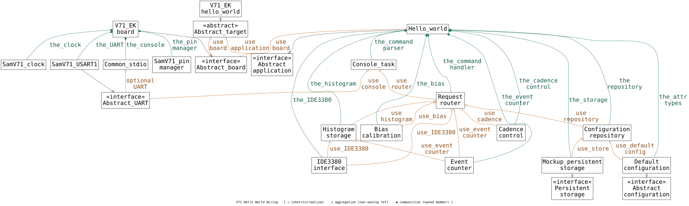

# AstraLEO Explore SAMV71 Peripherals, etc.

Using FreeRTOS (FreeRTOSv202604.01-LTS), copied selected code into this project.

## Wiring

Aggregation graph of `V71_EK_hello_world` — traced through its base class and the
concrete objects wired together in `main()`:

Graphviz source (larger/editable version): [`doc/hello_world_wiring_A4.dot`](doc/hello_world_wiring_A4.dot)

